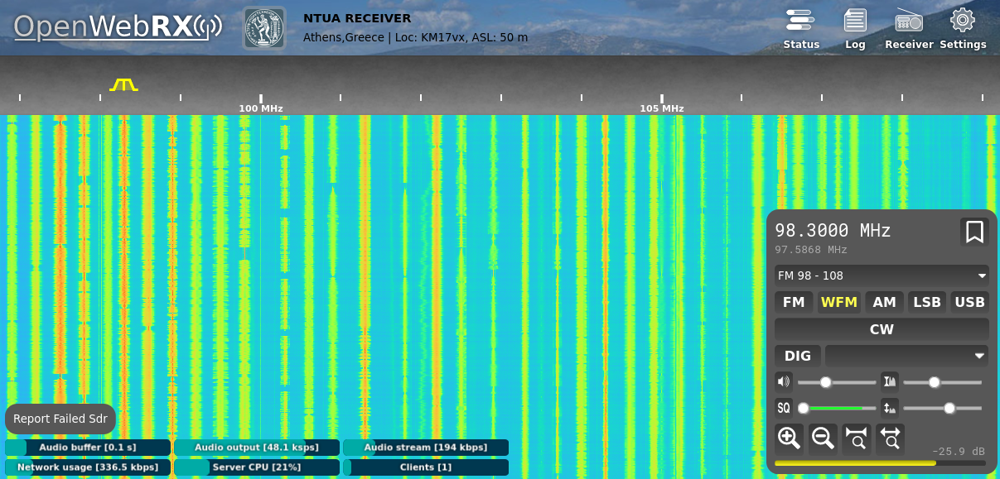

# Load Balancing OpenWebRX

Load Balancing OpenWebRX is a web-based app for SDR. It is an expansion of the OpenWebRX program. (https://github.com/jketterl/openwebrx)
OpenWebRX is an open source software for Linux, running on a PC connected with a SDR device. It enables the reception of the RF signal from the local antenna and demodulates it. Demodulated signal and waterfall graph are then sent, through the Internet, to the web browser of users around the world.

Load Balancing OpenWebRX adds a load balancer in front of a pool of OpenWebRX servers. It has many advantages as it:
* scales the number of supported clients.
* increases the potential number of connected SDR devices.
* enhances the coexistence of multiple users.
* handles SDR device failures.

You need at least 2 PCs or mini-PCs to make use of this software. Two OpenWebRX servers and one of them acting as a load balancer as well. You can also have 3 PCs with a separate load balancer. You can add as many servers as you want, depending on the desired number of supported clients and number of available SDR devices. There is no limit.

There is a load balancer (lb) part of the code and the OpenWebRX server (owrx) part. Use each one depending on the target function of the PC, or even use both in the same PC. The software is available for Linux. There is a detailed installation manual in the wiki page.

This is open source software, a GNU AGPL licence is included.

Contact: iliasz-ece@mail.com
